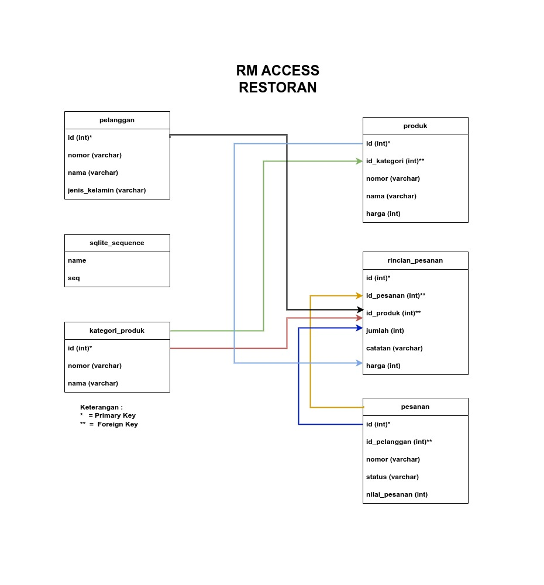
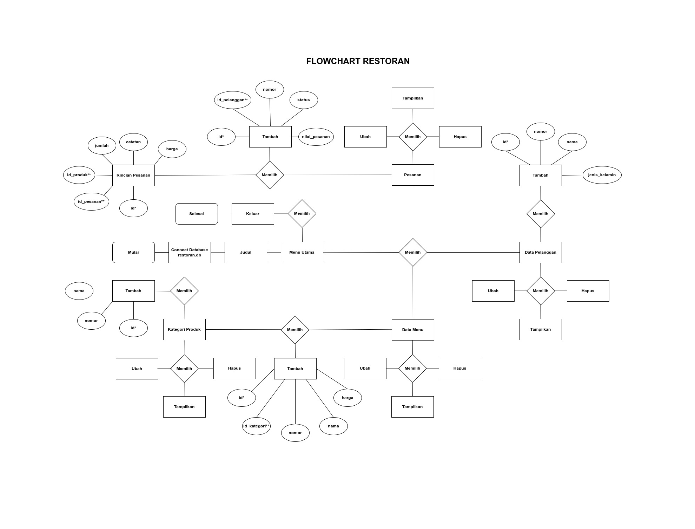

# **Aplikasi Manajemen Restoran**
Ini adalah aplikasi CRUD sederhana yang dibuat menggunakan Java dan SQLite3.

## Anggota
| NPM          | Nama                                                        |
| ------------ | ----------------------------------------------------------- |
| 202243500497 | [Alfarobby](https://github.com/Alfarobby27)                 |
| 202243500500 | [Ahmad Badawi](https://github.com/Ahmadbadawi123)           |
| 202243500501 | [Abdur Rosyid Fachriansyah](https://github.com/dellwatch21) |
| 202243500502 | [Sangga Buana](https://github.com/sanggabuana453)           |
| 202243500505 | [Taufik Ramadhan](https://github.com/Alfarobby27)           |  
| 202243500524 | [Riyan Rizaldy](https://github.com/riyanzaldy03)            |


## Memulai
1. Pastikan komputer kamu sudah terinstall [Git](https://git-scm.com/) dan [Java Development Kit](http://jdk.java.net/).
2. Kloning repositori ini ke komputer kamu dan masuk ke folder restoran dari terminal atau cmd
	```bash
	git clone https://github.com/Alfarobby27/Manajemen-Restoran.git && cd Manajemen-Restoran
	```
3. Lakukan kompilasi aplikasi
	```bash
	javac restoran.java
	```
4. Jalankan aplikasi
  * Windows
	```bash
	java -cp ".;sqlite-jdbc-3.40.0.0.jar" restoran
	```
  * Linux atau Mac
	```bash
	java -cp .:sqlite-jdbc-3.40.0.0.jar restoran
	```
	
## Schema / RM ACCESS	


## Flowchart	


## **Penjelasan**	
	

## Fitur
- [x] Data Pelanggan
  - [x] Melihat Data Pelanggan
  - [x] Menambah Data Pelanggan
  - [x] Merubah Data Pelanggan
  - [x] Menghapus Data Pelanggan
- [x] Data Menu
  - [x] Melihat Data Menu
  - [x] Menambah Data Menu
  - [x] Merubah Data Menu
  - [x] Menghapus Data Menu
- [x] Data Kelompok Menu
  - [x] Melihat Data Kelompok Menu
  - [x] Menambah Data Kelompok Menu
  - [x] Merubah Data Kelompok Menu
  - [x] Menghapus Data Kelompok Menu
- [x] Pesanan
  - [x] Melihat Daftar Pesanan
  - [x] Melihat Rincian Pesanan
  - [x] Menambah Pesanan
  - [x] Merubah Pesanan
  - [x] Menghapus Pesanan

## Catatan
Aplikasi ini menggunakan [Driver SQLite JDBC](https://github.com/xerial/sqlite-jdbc), seharusnya driver tersebut diunduh langsung dari sana, namun untuk memudahkan proses belajar terutama bagi pemula driver tersebut juga disertakan pada repositori ini.

## Thanks to
 [Jeffry Luqman](https://github.com/jeffry-luqman)
 
Contributed to help make this application
